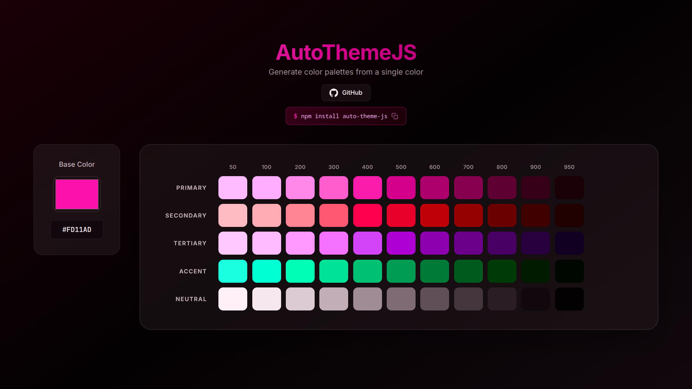

# AutoThemeJS

[](https://www.npmjs.com/package/auto-theme-js)
[](https://www.npmjs.com/package/auto-theme-js)
[](https://github.com/GustavoLGregorio/auto-theme-js/blob/main/LICENSE)
[](https://github.com/GustavoLGregorio/auto-theme-js/stargazers)
[](https://github.com/GustavoLGregorio/auto-theme-js/issues)

<p align="center">
  <a href="https://auto-theme-js.vercel.app/" target="_blank"><strong>🌐 Live Demo</strong></a> •
  <a href="https://www.npmjs.com/package/auto-theme-js"><strong>📦 npm</strong></a> •
  <a href="https://github.com/GustavoLGregorio/auto-theme-js"><strong>💻 GitHub</strong></a>
</p>

Generate beautiful, harmonious color palettes from a single base color. AutoThemeJS creates complete design system color schemes with primary, secondary, tertiary, accent, and neutral color variants across 11 shade levels (50-950), similar to Tailwind CSS color scales.

<p align="center">
  
</p>

## ✨ Features

- 🎨 **Single Color Input** - Generate a complete color palette from just one color
- 🌈 **Color Harmony** - Automatically creates harmonious color relationships (analogous, complementary)
- 📊 **11 Shade Levels** - Each color includes shades from 50 (lightest) to 950 (darkest)
- 🔄 **Multiple Color Formats** - Support for HEX, RGB, HSL, OKLCH, and OKLAB
- 💾 **Serialization** - Serialize and deserialize themes for storage or transfer
- 🏷️ **Versioning** - Built-in version tracking for stored themes
- 🪶 **Lightweight** - Zero dependencies, pure TypeScript
- 📦 **TypeScript Ready** - Full type definitions included

## 📦 Installation

```bash
npm install auto-theme-js
```

```bash
yarn add auto-theme-js
```

```bash
pnpm add auto-theme-js
```

## 🚀 Quick Start

```javascript
import { AutoTheme } from 'auto-theme-js';

// Create a theme from a hex color
const theme = new AutoTheme('#8a00bd', 'hex', 'hex', '50', '950');

// Access colors
console.log(theme.primary['500']);   // Primary color at shade 500
console.log(theme.secondary['300']); // Secondary (analogous +30°) at shade 300
console.log(theme.tertiary['700']);  // Tertiary (analogous -30°) at shade 700
console.log(theme.accent['500']);    // Accent (complementary) at shade 500
console.log(theme.neutral['900']);   // Neutral (desaturated) at shade 900

// Check version (useful for stored themes)
console.log(theme.version);          // e.g., 'V1'
```

## 📖 API Reference

### Constructor

```typescript
new AutoTheme(color, inputType?, outputType?, minShade?, maxShade?)
```

| Parameter | Type | Default | Description |
|-----------|------|---------|-------------|
| `color` | `Color` | required | The base color to generate the theme from |
| `inputType` | `ColorType` | `'hex'` | Input color format: `'hex'`, `'rgb'`, `'hsl'`, `'oklch'`, `'oklab'` |
| `outputType` | `ColorType` | `'hex'` | Output color format for all generated colors |
| `minShade` | `Shade` | `'50'` | Minimum shade to generate |
| `maxShade` | `Shade` | `'900'` | Maximum shade to generate |

### Theme Properties

Each `AutoTheme` instance contains five color groups plus metadata:

| Property | Description | Hue Rotation |
|----------|-------------|--------------|
| `primary` | Base color | 0° |
| `secondary` | Analogous color | +30° |
| `tertiary` | Analogous color | -30° |
| `accent` | Complementary color | +180° |
| `neutral` | Desaturated base | 0° (10% chroma) |
| `version` | Library version | - |
| `colorType` | Output color format | - |
| `baseColor` | Original input color | - |

### Shade Levels

Each color group contains shades from `50` to `950`:

```
50, 100, 200, 300, 400, 500, 600, 700, 800, 900, 950
```

- `50` - Lightest (97% lightness)
- `500` - Base (55% lightness)
- `950` - Darkest (8% lightness)

### Color Formats

```typescript
type ColorType = 'hex' | 'rgb' | 'hsl' | 'oklch' | 'oklab';
```

**Supported formats:**

```javascript
// HEX
'#8a00bd'
'#8a00bdff' // alpha not supported yet in v1, so avoid transparency

// RGB
'rgba(138, 0, 189, 1)'

// HSL
'hsla(284, 100%, 37%, 1)'

// OKLCH
'oklch(45.2% 0.234 303.4deg / 1)'

// OKLAB
'oklab(45.2% 0.123 -0.098 / 1)'
```

## 💾 Serialization & Deserialization

AutoThemeJS provides built-in methods to serialize themes for storage (localStorage, databases, etc.) and deserialize them back.

### Serialize

```javascript
import { AutoTheme } from 'auto-theme-js';

const theme = new AutoTheme('#8a00bd', 'hex', 'hex', '50', '950');

// Serialize the theme to a string
const serialized = AutoTheme.serialize(theme);
console.log(serialized);
// Output: "version:1.0.2|colorType:hex|baseColor:#8a00bd||primary:{50:#faf5ff|...}||..."

// Store it
localStorage.setItem('userTheme', serialized);
```

### Deserialize

```javascript
// Retrieve from storage
const serialized = localStorage.getItem('userTheme');

// Deserialize back to a theme object
const theme = AutoTheme.deserialize(serialized);

// Use the theme
console.log(theme.primary['500']); // #8a00bd
console.log(theme.colorType);      // 'hex'
console.log(theme.baseColor);      // '#8a00bd'
console.log(theme.version);        // '1.0.2'
```

### Version Checking

The `version` property allows you to handle breaking changes when loading stored themes:

```javascript
const theme = AutoTheme.deserialize(serialized);

// Check if theme was created with a compatible version
if (theme.version !== AutoTheme.VERSION) {
    console.log('Theme was created with a different version, consider regenerating');
}
```

### Custom Escape Character

If your color values might contain the default delimiter (`|`), you can specify a custom escape character:

```javascript
// Serialize with custom delimiter
const serialized = AutoTheme.serialize(theme, '*');

// Deserialize with the same delimiter
const theme = AutoTheme.deserialize(serialized, '*');
```

## 🎯 Usage Examples

### Dynamic Theme Application

```javascript
import { AutoTheme } from 'auto-theme-js';

function applyTheme(baseColor) {
    const theme = new AutoTheme(baseColor, 'hex', 'hex', '50', '950');
    const root = document.documentElement;
    
    // Apply CSS custom properties
    const properties = ['primary', 'secondary', 'tertiary', 'accent', 'neutral'];
    const shades = ['50', '100', '200', '300', '400', '500', '600', '700', '800', '900', '950'];
    
    for (const prop of properties) {
        for (const shade of shades) {
            root.style.setProperty(`--color-${prop}-${shade}`, theme[prop][shade]);
        }
    }
}

// Apply a purple theme
applyTheme('#8a00bd');
```

### React Integration

```jsx
import { AutoTheme } from 'auto-theme-js';
import { useState, useEffect } from 'react';

function ThemeProvider({ children, baseColor }) {
    const [theme, setTheme] = useState(null);
    
    useEffect(() => {
        const newTheme = new AutoTheme(baseColor, 'hex', 'hex', '50', '950');
        setTheme(newTheme);
        
        // Apply to CSS variables
        const root = document.documentElement;
        root.style.setProperty('--primary-500', newTheme.primary['500']);
        root.style.setProperty('--accent-500', newTheme.accent['500']);
        // ... more variables
    }, [baseColor]);
    
    return <ThemeContext.Provider value={theme}>{children}</ThemeContext.Provider>;
}
```

### Different Output Formats

```javascript
// Output as RGB
const rgbTheme = new AutoTheme('#8a00bd', 'hex', 'rgb', '50', '950');
console.log(rgbTheme.primary['500']); // 'rgba(138, 0, 189, 1)'

// Output as HSL
const hslTheme = new AutoTheme('#8a00bd', 'hex', 'hsl', '50', '950');
console.log(hslTheme.primary['500']); // 'hsla(284, 100%, 37%, 1)'

// Output as OKLCH (perceptually uniform)
const oklchTheme = new AutoTheme('#8a00bd', 'hex', 'oklch', '50', '950');
console.log(oklchTheme.primary['500']); // 'oklch(45.2% 0.234 303.4deg / 1)'
```

### Limited Shade Range

```javascript
// Generate only shades 400-700 for a more focused palette
const limitedTheme = new AutoTheme('#8a00bd', 'hex', 'hex', '400', '700');

console.log(limitedTheme.primary['400']); // ✅ Available
console.log(limitedTheme.primary['500']); // ✅ Available
console.log(limitedTheme.primary['50']);  // ❌ undefined (not in range)
```

## 🔧 TypeScript Support

AutoThemeJS is written in TypeScript and includes full type definitions:

```typescript
import { AutoTheme, Color, ColorType, Shade, ThemeProperties, Theme } from 'auto-theme-js';

const color: Color = '#8a00bd';
const theme: AutoTheme = new AutoTheme(color, 'hex', 'hex', '50', '950');

// Type-safe access
const primaryColor: Color = theme.primary['500'];
const shade: Shade = '500';
const property: ThemeProperties = 'primary';
```

## 🤝 Contributing

Contributions are welcome! Please feel free to submit a Pull Request.

1. Fork the repository
2. Create your feature branch (`git checkout -b feature/AmazingFeature`)
3. Commit your changes (`git commit -m 'Add some AmazingFeature'`)
4. Push to the branch (`git push origin feature/AmazingFeature`)
5. Open a Pull Request

## 📄 License

This project is licensed under the MIT License - see the [LICENSE](LICENSE) file for details.

## 🔗 Links

- [Live Demo](https://auto-theme-js.vercel.app/)
- [npm Package](https://www.npmjs.com/package/auto-theme-js)
- [GitHub Repository](https://github.com/GustavoLGregorio/auto-theme-js)
- [Report Issues](https://github.com/GustavoLGregorio/auto-theme-js/issues)

---

Made with ❤️ by [Gustavo L. Gregorio](https://github.com/GustavoLGregorio)
